# Rendered control hierarchy evidence

All PNGs are unmodified captures. Thread images use real Flutter widget rendering with deterministic transport fixtures and installed fonts. Browser images use release CanvasKit. None is a Preview or live staging capture.

## Workspace thread

| Viewport | Before | After |
| --- | --- | --- |
| 320px | 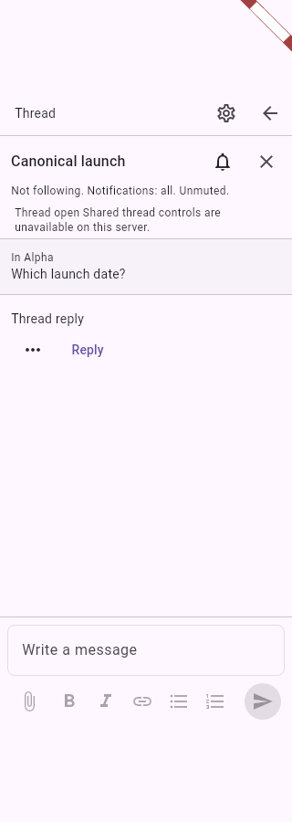 | 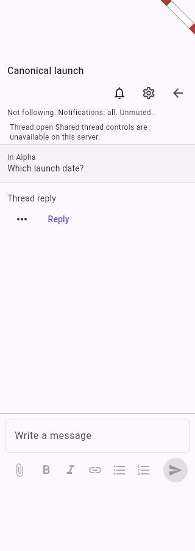 |
| 390px | 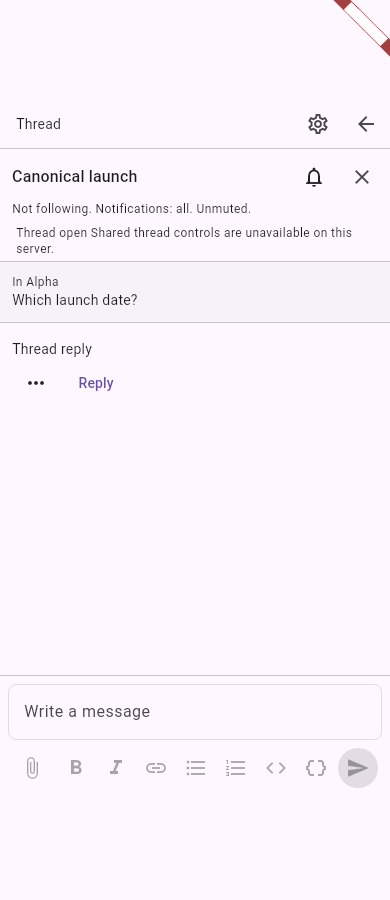 | 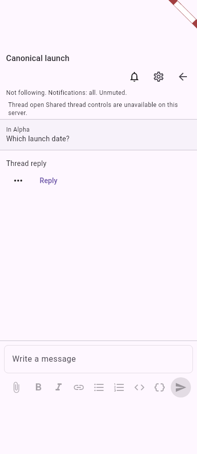 |
| 1400px | 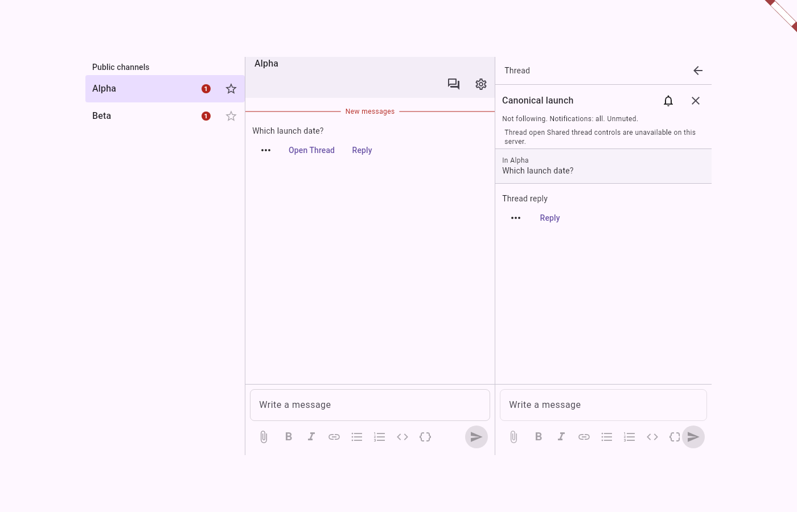 | 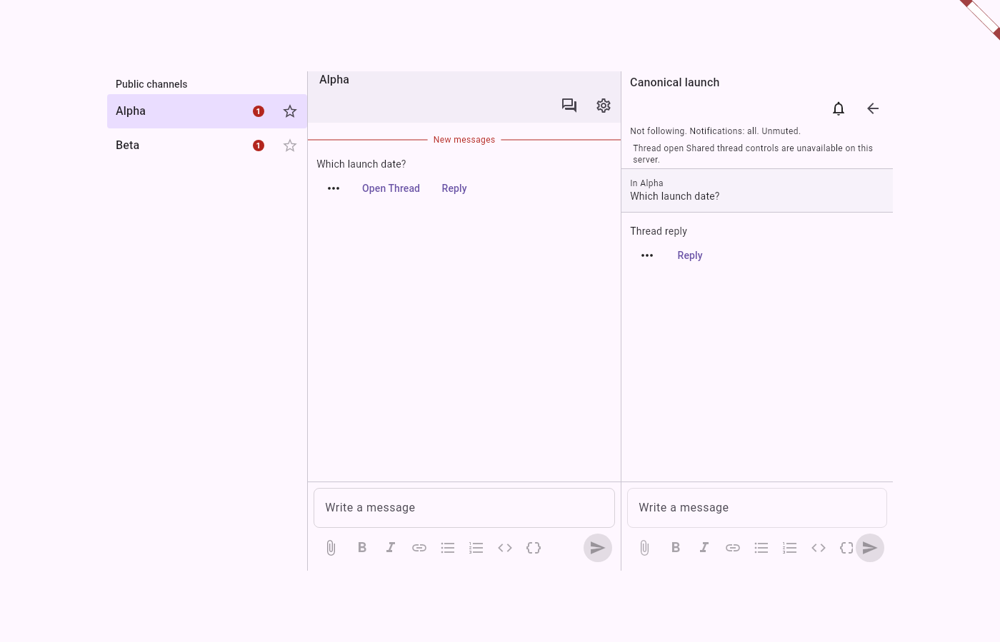 |

## Standalone title and permission denial

| Width | Before title | After title | After HTTP 403 |
| --- | --- | --- | --- |
| 320px | 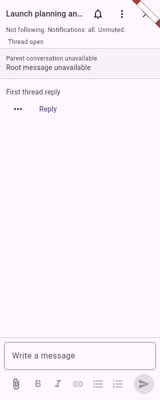 | 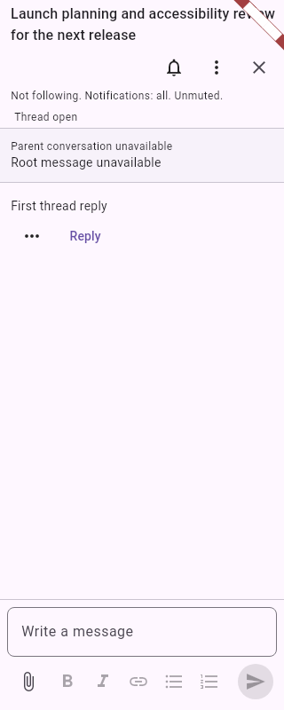 | 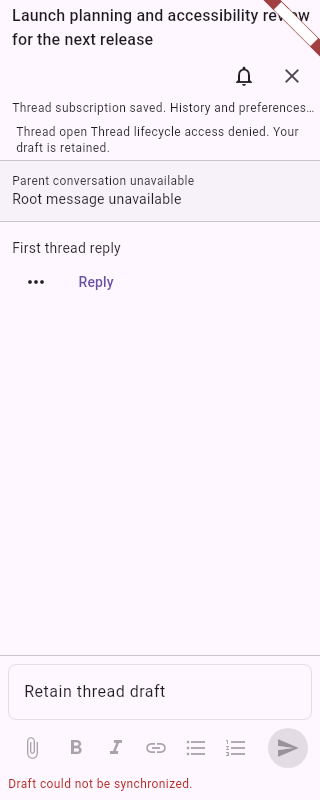 |
| 390px | 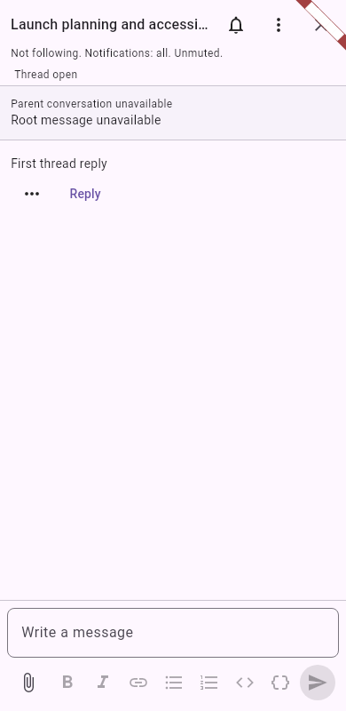 | 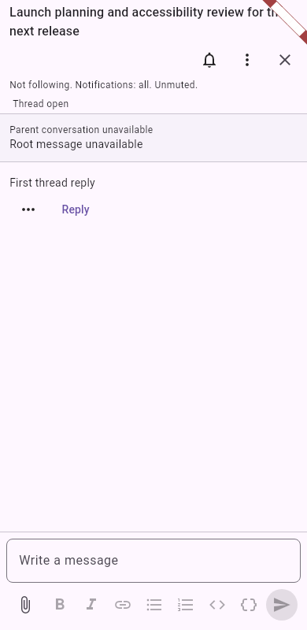 | 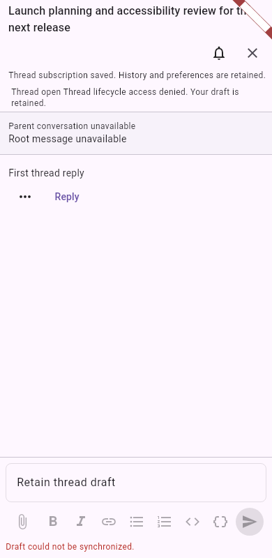 |
| 900px |  | 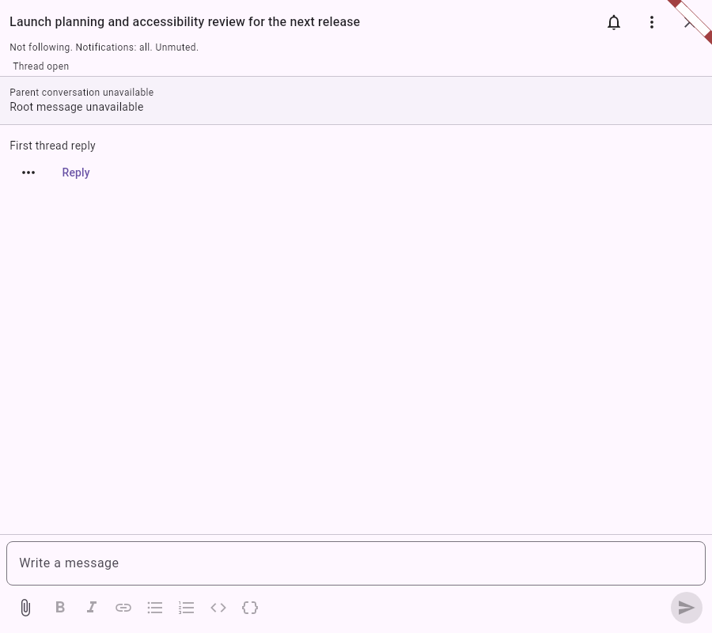 | 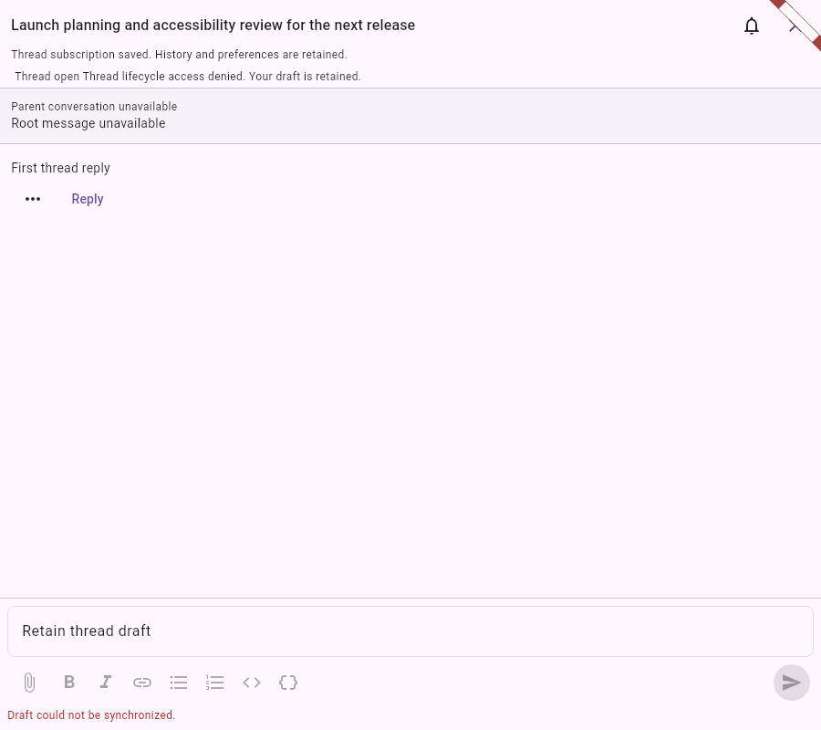 |

## Actual browser toolbar

Visual layout is intentionally retained; native accessibility changes from two buttons to one per format. The after-action images below retain failed semantics-enabled typing, not a claimed typing fix.

| Width | Before action, original SDK | After action, UI candidate |
| --- | --- | --- |
| 320px | 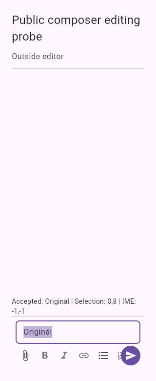 | 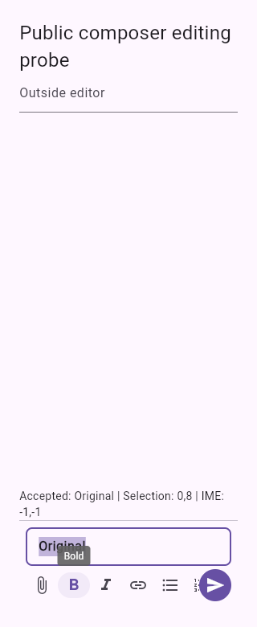 |
| 390px | 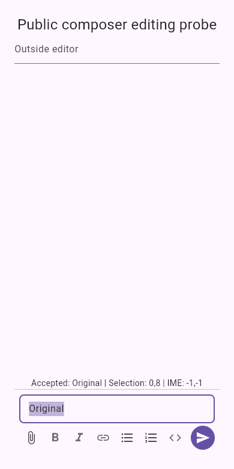 | 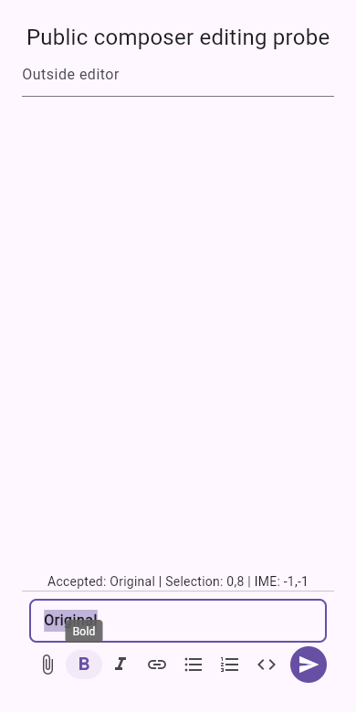 |
| 1050px | 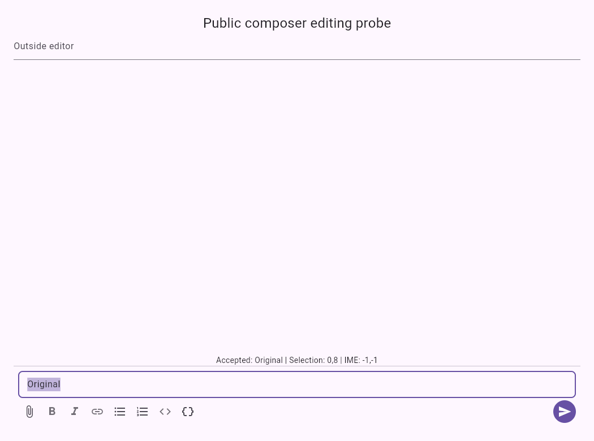 | 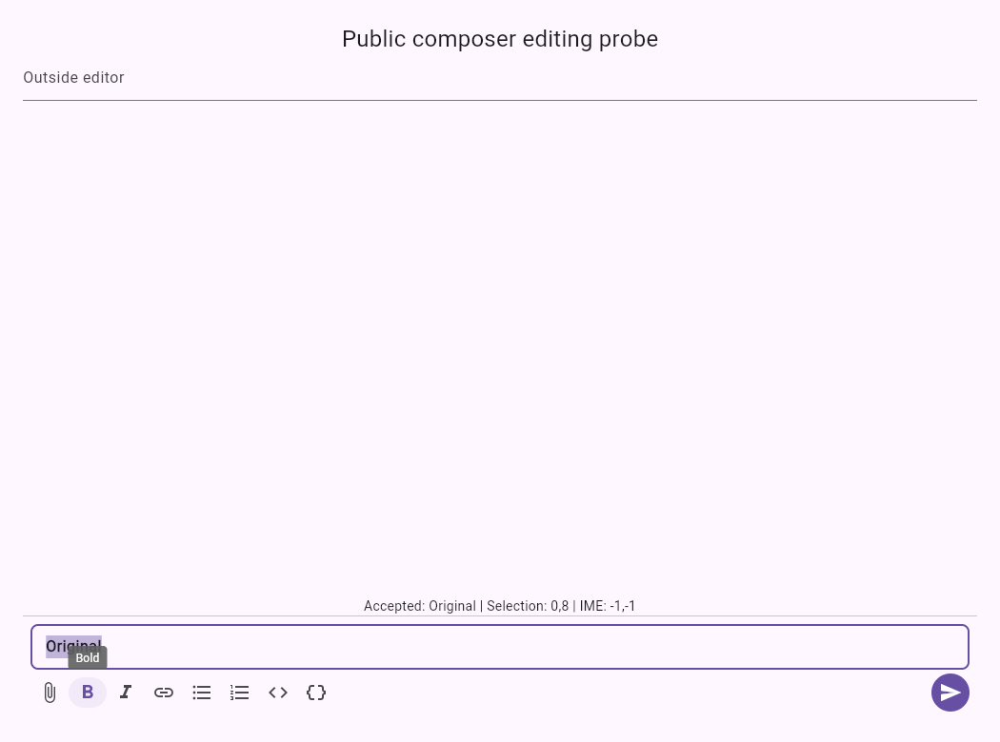 |

The 320px original browser image is explicitly from the retained prior qualification of the same published composer. Current-run paired widget toolbar renders are also available under `before-renders/toolbar-*.png` and `after-renders/toolbar-*.png`; `toolbar-scrolled-*.png` records keyboard reachability at the right edge. The code-block widget image uses the test renderer's fallback monospace glyphs, so browser captures are the typography reference.

See [qualification and reproduction](qualification.md) for exact sources, locks, fonts, commands and failures.
